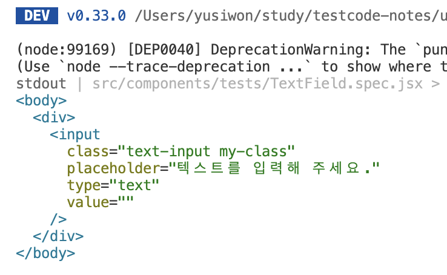

> [섹션 1. 프론트엔드 테스트 작성 준비하기](#섹션-1-프론트엔드-테스트-작성-준비하기)  
> [섹션 2. 단위 테스트란](#섹션-2-단위-테스트란)

# 섹션 1. 프론트엔드 테스트 작성 준비하기

## 1.1 테스트가 당신의 코드에 미치는 영향

### **테스트란?**

- 애플리케이션의 **품질과 안정성**을 높이기 위해 사전에 결함을 찾아내고 수정하기 위한 행위
- 주로 특정 모듈(특히 컴포넌트)이 **사양에 맞게 작동하는지 자동화된 방식**으로 검증
- 올바른 테스트 작성에 대한 개발자의 이해가 있어야 하며, **개발 비용이 증가**할 수 있다.

### **테스트 코드의 효과**

**1. 좋은 설계에 대한 사고를 돕는다.**

- **결합도(coupling)**: 한 모듈이 다른 모듈에 의존하는 정도 → 낮을수록 좋다.
- 결합도가 높으면 한 모듈 수정 시 다른 모듈에도 영향을 줄 수 있다. (하나의 페이지에서 모든 비즈니스 로직을 개발하는 경우)
  - 특정 기능만 따로 검증하기 어렵다.
  - 복잡한 구조로 필요한 테스트가 누락될 수 있다.
  - 여러 테스트 코드를 계속 수정해야 한다.
- ⇒ 테스트 단위를 나누는 과정에서 자연스럽게 **의존성을 줄이고 올바른 설계**를 고민하게 된다. 즉, 더 넓은 사고를 가지게 된다.

**2.  테스트 코드를 기반으로 빠르고 안정적이게 리팩토링할 수 있다.**

- **리팩토링**: 결과의 변경 없이 코드의 구조를 재조정하는 것
- 거대한 리팩토링 범위를 가진 모듈은 문제가 발생했을 때 원인 파악이 어렵다.
- 작은 단위로 나누면 작업 속도도 빨라지고, 문제 범위도 좁아져서 쉽게 해결할 수 있다.
  > "한 가지를 수정할 때마다 테스트하면, 오류가 생기더라도 변경 폭이 작기 때문에 살펴볼 범위도 좁아서 문제를 찾고 해결하기가 훨씬 쉽다. 이처럼 조금씩 변경하고 매번 테스트하는 것은 리팩터링 절차의 핵심이다."
- 잘 작성된 테스트 코드가 있으면 리팩토링뿐 아니라 **새로운 기능 추가 시 사이드이펙트를 방지**할 수 있다.
  - 물론, 새로운 기능에 대한 테스트 코드 작성은 필요하다.

**3. 좋은 테스트 코드는 애플리케이션의 이해를 돕는 문서가 된다.**

- 잘 작성된 테스트 코드는 **애플리케이션의 동작을 설명하는 문서**로 활용될 수 있다.


---

## 1.2 올바른 테스트 작성을 위한 규칙

모든 프론트엔드 테스트에 공통적으로 적용되는 기본 규칙이다.

### ① 인터페이스를 기준으로 테스트를 작성하자.

- **인터페이스**: 서로 다른 클래스 또는 모듈이 상호작용하는 시스템
- 모든 테스트는 세부 구현이 아니라 외부에 노출되는 퍼블릭 메서드(인터페이스)를 기준으로 작성해야 한다.
- 내부 구현을 직접 테스트하는 것은 **캡슐화를 위반**하며, 깨지기 쉬운 테스트를 만든다.

**내부 구현을 기준으로 작성한 테스트의 문제점**

- 불필요하게 많은 테스트 코드가 양산된다.
- 내부 구현과 강한 의존성을 가지므로, 구현이 조금만 변경되어도 테스트가 깨진다.
- 유지보수 비용이 크다.
- Ex. 리액트 컴포넌트: 내부의 상태를 강제로 직접 변경하면 안된다. 컴포넌트와 통신할 수 있는 **외부의 인터페이스를 통해 변경**되는지 검증해야 한다.

**잘못된 테스트**

```jsx
// ❌ 잘못된 테스트 코드
it('isShowModal 상태를 true로 변경했을 때 ModalComponent의 display 스타일이 block이며, "안녕하세요!" 텍스트가 노출된다.', () => {
  // 구현에 종속적인 코드와 복잡한 상태 변경 코드들이 발생할 수 있다.
  SpecificComponent.setState({ isShowModal: true });
});
```

- 변경되는 상태가 많은 경우 테스트 코드 상에서 일일이 직접 변경해야 하며, **어떤 상황에서 변경되는 것인지 드러나지 않는다**.
- 어떤 것을 검증하는지 테스트 코드만 보고 한 눈에 파악하기 어렵다.
- 구현에 종속적인 테스트 코드가 양산된다. 상태나 변수명이 하나라도 바뀌면 테스트 코드 모두를 바꿔야 한다. 즉, 캡슐화를 위반하는 코드가 된다.
  - `isShowModal` 변수명이 변경되면 테스트 코드에서도 변경해야 한다.

그럼 컴포넌트에서 상태를 변경할 수 있도록 제공되는 인터페이스는 무엇일까? ⇒ **DOM 이벤트 핸들러**

**올바른 테스트**

```jsx
// 🔵 올바른 테스트 코드
it('버튼을 누르면 모달을 띄운다.', () => {
  // 유저의 동작과 비슷하도록 클릭 이벤트를 발생
  user.click(screen.getByRole('button'));
});
```

- 내부 구현과 종속성이 없으며 캡슐화에 위반되지 않는다.
- 어떤 행위를 하는지 명확하다.
- 테스트를 설명하기 위한 불필요한 주석이나 설명이 필요 없다.

### ② 커버리지 보다는 의미있는 테스트인지 고민하자.

- **커버리지**: 테스트 코드가 프로덕션 코드의 몇 %를 검증하는지 나타내는 지표 (기준: 구문, 분기, 함수, 줄 등)
- 흔한 실수: 100% 커버리지를 목표로 모든 코드를 검증하려는 것
  - 현실적으로 100% 커버리지로 작성하는 것은 불가능하며, 가능하다 해도 테스트 작성, 실행, 유지 보수 비용이 크다.
  - 커버리지 100%여도 잘못된 검증 때문에 문제가 발생할 수 있다.
- 단순한 연산 함수는 과감히 생략 → 더 큰 모듈이나 컴포넌트 테스트 안에서 함께 검증하는 것이 효율적
- 100% 커버리지를 위한 테스트보다는 **의미있는 테스트인지**, **어떤 범위까지 검증해야 효율적인 테스트가 될지**를 고민해야 한다.

### ③ 가독성을 높이자. 테스트 코드도 유지 보수 대상이다.

- 테스트하고자 하는 내용을 명확히 작성해야 한다.

  ```jsx
  // ❌ 잘못된 테스트 코드
  it('리스트에서 항목이 제대로 삭제된다.', () => { ... })

  // 🔵 올바른 테스트 코드
  it('항목들을 체크한 후 삭제 버튼을 누르면 리스트에서 체크된 항목들이 삭제된다.', () => { ... })
  ```

- 하나의 테스트에서는 가급적 하나의 동작만 검증해야 한다.
  - **단일 책임 원칙(SRP, Single Responsibility Principle)**: 모든 클래스는 하나의 책임을 갖고 그와 관련된 책임을 캡슐화하여 **변경에 견고한 코드**를 만들어야 한다.  
    ⇒ 테스트에서도 동일하다. **검증 범위의 책임을 나누는 것**이 중요하다.
  - 다양한 컴포넌트들이 조합되었을 때의 시나리오를 검증해야 한다면 하나의 케이스에서 한 번에 검증하는 것이 아닌, **여러 개로 나눠 검증**하는 것이 가독성에 좋다.
    ```jsx
    // ❌ 잘못된 테스트 코드
    // - 가격 로직에 대한 로직만 수정되어도 테스트 자체가 깨지게 된다.
    // - 어떤 동작에서 실패했는지 찾기 어렵다.
    it('장바구니에 담긴 상품들이 정상적으로 노출되고, 수량을 변경하면 가격이 재계산된다. 그리고 삭제 버튼을 누르면 상품이 삭제된다.', () => { ... })
    ```
    ```jsx
    // 🔵 올바른 테스트 코드
    // - 각 검증의 책임이 명확하게 나눠져 있다.
    // - 유지보수가 쉽고 가독성이 좋다.
    it('장바구니에 담긴 상품들을 정상적으로 렌더링한다.', () => { ... })
    it('장바구니에 담긴 상품의 수량을 수정하면 가격이 재계산된다.', () => { ... })
    it('장바구니에 담긴 항목의 삭제 버튼을 누르면 리스트에서 삭제된다.', () => { ... })
    ```

---

## 1.3 예제 프로젝트 소개

**사용 기술 스택**

- Front: `react` `tanstack Query` `MUI` `React Hook Form` `zustand`
- Server: `express.js`
- Build tool: `vite`
- Test: `vitest` `cypress` `Testing Library` `Storybook` `MSW Chromatic`

---

## 섹션 1. 퀴즈

- Q: 테스트 코드가 애플리케이션 코드에 주는 주요 이점은 무엇일까요?  
  A: 앱 품질 향상 및 안정성 증대
- Q: 테스트 코드가 리팩터링 과정에 어떤 긍정적인 영향을 줄까요?  
  A: 변경 사항이 기존 기능을 해치지 않는지 빠르게 검증한다.
- Q: 올바른 테스트 코드 작성을 위해 권장되는 주요 접근 방식은 무엇일까요?  
  A: 공개된 인터페이스 또는 메서드 기반으로 테스트한다.
- Q: 테스트 코드 작성 시, 단순히 높은 커버리지 숫자를 달성하는 것보다 더 중요하게 고려해야 할 것은 무엇일까요?  
  A: 실제로 중요한 기능이나 로직을 검증하는 의미 있는 테스트를 작성하는 것
- Q: 좋은 테스트 코드가 갖춰야 할 가독성 원칙 중, 단일 책임 원칙에 따라 권장되는 사항은 무엇일까요?  
  A: 하나의 테스트는 하나의 특정 동작만 검증한다.

&nbsp;

# 섹션 2. 단위 테스트란?

## 2.1 단위 테스트란 무엇일까?

### 단위 테스트란?

- **단일 함수**의 결괏값 또는 **단일 컴포넌트(클래스)**의 상태(UI)나 행위를 검증
- 앱에서 테스트 가능한 가장 작은 소프트웨어를 실행해 예상대로 동작하는지 확인
- 가장 작은 소프트웨어: **단일 함수** 또는 **단일 컴포넌트(클래스)**
- 검증 대상: 결괏값, 상태(UI), 행위

### 단위 테스트 예제 살펴보기

- **공통 컴포넌트**는 단위 테스트에 적합하다.
  - 버튼, 텍스트 인풋, 캐러셀, 아코디언 등
  - 컴포넌트 내부 비스니스 로직을 기능 단위로 나눠 검증하기 좋다.
  - 범용적으로 재사용되기 때문에 단위 테스트를 통해 안정성을 보장해야 한다.

### Arrange-Act-Assert 테스트 작성 패턴 (AAA 패턴)

단위 테스트 작성의 대표적인 패턴

① **Arrange**: 테스트를 위한 **환경** 만들기

- 컴포넌트 렌더링, 초기 상태 세팅

② **Act**: 테스트할 **동작** 발생

- 클릭, 키 입력, 메서드 호출 등

③ **Assert**: 기대 결과대로 실행되었는지 검증

- DOM 변경, 값 변경 등 올바르게 실행되었는지 확인

### 예제: `className`에 대한 테스트 코드

- React Testing Library를 활용하면 컴포넌트 테스트를 쉽게 작성할 수 있다.
- 여기서는 `render` API를 사용한다.

- `TextField.tsx`: 테스트할 TextField 컴포넌트

  ```jsx
  import cn from 'classnames';
  import React, { useState } from 'react';
  import './text.css';

  /**
   * placeholder 설정 - 테스트 작성 완료
   * className에 따른 css class 설정 - 테스트 작성 완료
   * 텍스트를 입력할 때마다 onChange 핸들러 호출
   * focus 시 border 스타일 변경
   * focus 시 onFocus 핸들러 호출
   * Enter 키 입력 시 onEnter 핸들러 호출
   */
  export default function TextField({
    placeholder,
    className,
    onFocus,
    onChange,
    onEnter,
  }) {
    const [value, setValue] = useState('');
    const [focused, setFocused] = useState(false);

    const changeValue = ev => {
      setValue(ev.target.value);
      onChange?.(ev.target.value);
    };
    const focus = () => {
      setFocused(true);
      onFocus?.();
    };
    const blur = () => {
      setFocused(false);
    };
    const pressEnter = ev => {
      if (ev.key === 'Enter' && !ev.nativeEvent.isComposing) {
        ev.preventDefault();
        onEnter?.(value);
      }
    };

    return (
      <input
        type="text"
        className={cn('text-input', className)}
        onChange={changeValue}
        onFocus={focus}
        onBlur={blur}
        onKeyDown={pressEnter}
        placeholder={placeholder || '텍스트를 입력해 주세요.'}
        value={value}
        style={
          focused ? { borderWidth: 2, borderColor: 'rgb(25, 118, 210)' } : null
        }
      />
    );
  }
  ```

**React Testing Library 쿼리 타입**


**React Testing Library 쿼리**


**테스트 코드** `TextField.spec.jsx`

```jsx
import { screen } from '@testing-library/react';
import React from 'react';

import TextField from '@/components/TextField';
import render from '@/utils/test/render';

// description 작성하기
it('className prop으로 설정한 css class가 적용된다.', async () => {
  // ① Arrange: 테스트를 위한 환경 만들기
  // - className을 지닌 컴포넌트 렌더링
  // render API 호출: 테스트 환경의 jsDOM에 리액트 컴포넌트가 렌더링된 DOM 구조가 반영
  // jsDOM: Node.js에서 사용하기 위해 많은 웹 표준을 순수 자바스크립트로 구현
  await render(<TextField className="my-class" />);

  // ② Act: 테스트할 동작 발생
  // - 렌더링에 대한 검증이기 때문에 이 단계는 생략
  // - 클릭이나 메서드 호출, prop 변경 등등에 대한 작업이 여기에 해당

  // ③ Assert: 올바른 동작이 실행되었는지 검증
  // - 렌더링 후 DOM에 해당 class가 존재하는지 검증
  // vitest의 expect 함수를 사용하여 기대 결과를 검증
  // className이란 내부 prop이나 state 값을 검증 (X)
  // 렌더링되는 DOM 구조가 올바르게 변경되었는지 확인 (O) -> 최종적으로 사용자가 보는 결과는 DOM이기 때문
  expect(screen.getByPlaceholderText('텍스트를 입력해 주세요.')).toHaveClass(
    'my-class',
  );
});
```


### 단위 테스트 코드 작성 규칙

- **상세한 테스트 설명(description)**을 통해 가독성을 향상시킨다.
- 내부 DOM 구조나 로직에 직접 의존하지 않도록 **Testing Library API**를 통해 적절한 요소를 찾고 검증한다.
- 컴포넌트의 최종 렌더링 결과물인 **DOM 구조가 올바르게 반영되었는지 검증**한다.

---

## 2.2 테스트 환경과 매처(Matcher)

### 테스트 프레임워크

- **테스트 실행 및 검증 환경**을 제공하는 도구
  - 태스크 러너, 어설션 라이브러리, 플러그인 등 포함
- 프론트엔드 단위/통합 테스트는 보통 **Node.js 환경**에서 구동된다.
- 강의에서는 **Vitest**를 사용한다.
  - Vite 기반, 별다른 설정 없이 테스트 실행 가능
  - 추가 설정 없이 ESM, TypeScript, JSX 사용 가능
  - Jest 호환 API 및 가이드 제공

**`vite.config.js` 설정 예시**

```jsx
export default defineConfig({
  test: {
    globals: true,
    environment: 'jsdom',
    setupFiles: './src/utils/test/setupTests.js',
  },
  ...
});
```

- `globals`: Vitest 함수들을 import 없이 사용 가능
- `environment: ‘jsdom’`: 브라우저 환경 대신 jsdom에서 구동
- `setupFiles`: jest-dom 임포트 및 테스트 실행 전 공통 설정

**`setupTest.js` 예시**

```jsx
import '@testing-library/jest-dom';

afterEach(() => {
  vi.clearAllMocks();
});

afterAll(() => {
  vi.resetAllMocks();
});

// https://github.com/vitest-dev/vitest/issues/821
Object.defineProperty(window, 'matchMedia', {
  writable: true,
  value: vi.fn().mockImplementation(query => ({
    matches: false,
    media: query,
    onchange: null,
    addListener: vi.fn(), // deprecated
    removeListener: vi.fn(), // deprecated
    addEventListener: vi.fn(),
    removeEventListener: vi.fn(),
    dispatchEvent: vi.fn(),
  })),
});
```

### jsdom

- Node.js 환경에는 DOM이 없으므로, 브라우저 없이 DOM을 흉내내는 도구
- 표준 스펙 기반으로 구현되었으나, 실제 브라우저와 차이가 있을 수 있다.
- 직접 화면을 볼 수 없으므로 `screen.debug()`로 확인하면 된다.

```jsx
const textInput = screen.getByPlaceholderText('텍스트를 입력해 주세요.');

screen.debug();

expect(textInput).toHaveClass('my-class');
```



### it, test, describe

**it()**

- **테스트의 실행 단위**로서 테스트 디스크립션, 기대 결과에 대한 코드를 작성
- it 함수는 **test 함수의 alias**로서 완전히 동일하다.
- ‘기대 결과’와 ‘실제 결과’를 비교한다.
  - 성공: `기대 결과 === 실제 결과`
  - 실패: `기대 결과 !== 실제 결과`

**describe()**

- 관련된 테스트들을 그룹핑
- 독립적인 블록/컨텍스트 생성
- 해당 블록 안에서만 필요한 설정 가능 → 다른 테스트에 영향 없음

### 단언(Assertion)과 매처(Matcher)

매처를 사용하여 단언한다. `expect(대상) + matcher`

**단언(assertion)**

- 테스트가 통과하기 위한 조건을 기술하여 검증을 실행한다.

**매처(matcher)**

- 기대 결과를 검증하기 위해 사용되는 일종의 **API 집합**
- vitest에서는 다양한 기본 매처를 제공하며, 이를 확장하여 단언을 실행할 수 있다.
- https://vitest.dev/api/expect.html
- https://github.com/testing-library/jest-dom?tab=readme-ov-file#custom-matchers

```jsx
expect(element).toBeInTheDocument();
expect(value).toBeUndefined();
expect(value).toBeNull();
```

- DOM 관련 매처는 기본적으로 없다. → `@testing-library/jest-dom`으로 확장해야 한다.
  - 예: `toBeInTheDocument`, `toHaveClass` 등
  - 명확한 에러 메시지를 제공하여 문제를 빠르게 파악할 수 있다.

### 예제: placeholder 확인

```jsx
it('기본 placeholder "텍스트를 입력해 주세요."가 노출된다.', async () => {
  await render(<TextField />);
  const textInput = screen.getByPlaceholderText('텍스트를 입력해 주세요.');
  expect(textInput).toBeInTheDocument();
});
```

### 예제: placeholder prop 변경 검증

```jsx
it('placeholder prop에 따라 placeholder가 변경된다.', async () => {
  await render(<TextField placeholder="상품명을 입력해 주세요." />);
  const textInput = screen.getByPlaceholderText('상품명을 입력해 주세요.');
  expect(textInput).toBeInTheDocument();
});
```

### describe로 그룹핑하기

두 예제를 하나의 그룹으로 묶으면 가독성이 좋아진다.

```jsx
describe('placeholder', () => {
  it('기본 placeholder "텍스트를 입력해 주세요."가 노출된다.', async () => {
    await render(<TextField />);

    const textInput = screen.getByPlaceholderText('텍스트를 입력해 주세요.');

    expect(textInput).toBeInTheDocument();
  });

  it('placeholder prop에 따라 placeholder가 변경된다.', async () => {
    await render(<TextField placeholder="상품명을 입력해 주세요." />);

    const textInput = screen.getByPlaceholderText('상품명을 입력해 주세요.');

    expect(textInput).toBeInTheDocument();
  });
});
```

### 정리

- **Vitest + jsdom + jest-dom** 조합으로 프론트엔드 테스트 환경을 구축한다.
- **it/test**: 개별 테스트 단위 / **describe**: 테스트 그룹핑
- **매처**는 기대 결과 검증의 핵심 도구이며, jest-dom으로 DOM 단언을 확장한다.

---

## 2.3 setup과 teardown

- **테스트는 항상 독립적으로 실행**되어야 한다.
- 테스트 순서나 다른 테스트의 실행 여부에 따라 결과가 달라지만 안 된다.
- **독립성을 보장**하기 위해 **setup과 teardown**을 사용한다.
  - **setup**: 테스트 실행 전 필요한 준비 작업
  - **teardown**: 테스트 실행 후 정리 작업

### setup - 준비 단계

| Hook         | 실행 시점                           | 범위                      |
| ------------ | ----------------------------------- | ------------------------- |
| `beforeEach` | 각 테스트 실행 전                   | 해당 scope 내 모든 테스트 |
| `beforeAll`  | sceop 내 모든 테스트 실행 전 단 1회 | 해당 scopre               |

**역할**

- 테스트 실행 전 공통 환경, 상태, 데이터 세팅
- 반복되는 초기화 작업을 그룹화
- 테스트 독립성 확보

**setup 사용 예시**

- 반복되는 렌더링 로직은 `beforeEach`에 넣어 공통화한다.
- 매 테스트가 독립적으로 동일한 환경에서 실행된다.
- Ex. 모든 테스트에서 `className=”my-class”`가 적용된 `TextField`를 렌더링한다고 가정

  ```jsx
  beforeEach(async () => {
    await render(<TextField className="my-class" />);
  });

  it('className prop으로 설정한 css class가 적용된다.', async () => {
    // await render(<TextField className="my-class" />);
    const textInput = screen.getByPlaceholderText('텍스트를 입력해 주세요.');
    expect(textInput).toHaveClass('my-class');
  }
  ```

### teardown - 정리 단계

| Hook        | 실행 시점                           | 범위                      |
| ----------- | ----------------------------------- | ------------------------- |
| `afterEach` | 각 테스트 실행 후                   | 해당 scope 내 모든 테스트 |
| `afterAll`  | scope 내 모든 테스트 종료 후 단 1회 | 해당 scope                |

**역할**

- 테스트 실행 후 상태 초기화
- 모킹(Mock) 리셋
- 전역 환경 정리

### 실행 순서 정리

- `description` 블록은 테스트를 그룹화하고 독립된 setup/teardown을 관리한다.

```jsx
beforeEach(() => {
  console.log('root - beforeEach');
});

beforeAll(() => {
  console.log('root-beforeAll');
});

afterEach(() => {
  console.log('root-afterEach');
});

afterAll(() => {
  console.log('root-afterAll');
});

/* 테스트1: className prop */
it('className prop으로 설정한 css class가 적용된다.', async () => {...});

describe('placeholder', () => {
  beforeEach(() => {
    console.log('placeholder - beforeEach');
  });

  beforeAll(() => {
    console.log('placeholder-beforeAll');
  });

  afterEach(() => {
    console.log('placeholder-afterEach');
  });

  afterAll(() => {
    console.log('placeholder-afterAll');
  });

	/* 테스트2: placeholder 기본 */
  it('기본 placeholder "텍스트를 입력해 주세요."가 노출된다.', async () => {...});

	/* 테스트3: placeholder prop */
  it('placeholder prop에 따라 placeholder가 변경된다.', async () => {...});
});
```

결과:

```jsx
root - beforeAll;

root - beforeEach;
/* 테스트1: className prop */
root - afterEach;

placeholder - beforeAll;

root - beforeEach;
placeholder - beforeEach;
/* 테스트2: placeholder 기본 */
placeholder - afterEach;
root - afterEach;

root - beforeEach;
placeholder - beforeEach;
/* 테스트3: placeholder prop */
placeholder - afterEach;
root - afterEach;

placeholder - afterAll;

root - afterAll;
```

### 모든 테스트에 적용하기

- 전역 setup/teardown은 **vite 설정**의 `setupTests.js` 파일에서 관리한다.

```jsx
afterEach(() => {
  vi.clearAllMocks(); // 모든 모킹 초기화
});

afterAll(() => {
  vi.resetAllMocks(); // 모킹 리셋
});
```

**전역 모킹**

- jsdom에는 브라우저에 존재하는 `window.matchMedia`가 없으므로 테스트 시 에러가 발생할 수 있다.
- ⇒ 테스트 실행 전 `setupTests.js` 같은 전역 설정 파일에서 모킹해야 한다.

```jsx
Object.defineProperty(window, 'matchMedia', {
  writable: true,
  value: vi.fn().mockImplementation(query => ({
    matches: false,
    media: query,
    onchange: null,
    addListener: vi.fn(), // deprecated
    removeListener: vi.fn(), // deprecated
    addEventListener: vi.fn(),
    removeEventListener: vi.fn(),
    dispatchEvent: vi.fn(),
  })),
});
```

**매처 확장**

- DOM 관련 매처(`toBeInTheDocument`, `toHaveClass` 등)를 사용하기 위해서는 `setupTests.js`에 `import '@testing-library/jest-dom';`를 추가해야 한다.
- 전역에 등록해야 `expect(…).toBeInTheDocument` 같은 문법을 사용할 수 있다.

### 주의사항

- 전역 변수를 조건부로 사용하면 테스트 독립성을 해친다.

```jsx
// ❌ 안 좋은 예시
// 테스트 실행 순서에 따라 결과가 달라져 신뢰성이 낮아진다.
let someCondition = false;

beforeEach(async () => {
  if (someCondition) {
    await render(<TextField className="my-class" />);
  }
});
```

### 정리

- setup과 teardown을 통해 테스트 실행 전, 후 실행되어야 할 **반복 작업을 깔끔하게 관리**할 수 있다.
- 테스트 별로 별도의 스코프로 동작하기 때문에 **독립적인 테스트를 구성**하는데 도움을 받을 수 있다.
- setup, teardown에서 전역 변수를 사용한 조건 처리는 독립성을 보장하지 못하고, 신뢰성이 낮아지므로 지양해야 한다.

---

## 2.4 React Testing Library와 컴포넌트 테스트

### React Testing Library

- UI 컴포넌트 테스트를 도와주는 라이브러리
- 특정 개발 프레임워크나 테스트 프레임워크에 종속되지 않는다.
- ‘**사용자가 사용하는 방식으로 테스트하자**’는 철학을 갖는다.
  - DOM 노드를 쿼리하고 이벤트를 실제 사용자처럼 발생시킨다.
  - → DOM Testing Library를 기반으로 React 환경에 맞게 확장된 것이 **React Testing Library**

**장점**

- 내부 구현이나 종속성 없이 캡슐화를 지킨다.
- DOM과 이벤트 인터페이스 기반으로 검증한다.
- 테스트 코드가 직관적이고 이해하기 쉽다.
- 캡슐화를 위반하는 코드가 없어 견고하고 신뢰성 있는 테스트가 가능하다.

### 예시: 텍스트를 입력 시 onChange 핸들러 호출

```jsx
it('텍스트를 입력하면 onChange prop으로 등록한 함수가 호출된다.', async () => {
  const spy = vi.fn(); // 스파이 함수
  const { user } = await render(<TextField onChange={spy} />);

  const textInput = screen.getByPlaceholderText('텍스트를 입력해 주세요.');

  await user.type(textInput, 'test');

  expect(spy).toHaveBeenCalledWith('test');
});
```

### render 유틸 함수

- 테스트 환경에서 반복되는 로직을 추상화한 함수

```jsx
import { render } from '@testing-library/react';
import userEvent from '@testing-library/user-event';

export default async component => {
  const user = userEvent.setup();

  return {
    user,
    ...render(component),
  };
};
```

- `userEvent`: 클릭, 키보드 입력 등 브라우저와 유사한 이벤트 시뮬레이션을 지원한다.
- `setup()`을 호출해 얻은 인스턴스를 `user`로 할당하고, 이후 모든 테스트에서 이를 사용한다.

### 요소 조회 API

- `getByPlaceholderText`, `getByText`, `getByAltText`, `getByRole` 등 다양한 쿼리 함수를 제공한다.
- 주어진 요소로 조회하기 힘든 경우, DOM에 직접 `testId` 속성을 추가하여 조회할 수 있도록 `getByTestId` 제공한다.
  - `testId`를 통한 조회는 실제 사용자 방식과 무관하므로 가급적 다른 쿼리를 사용하는 것이 좋다
- [쿼리 우선순위 문서 참고](https://testing-library.com/docs/queries/about/#priority)
  

### Spy 함수

- 함수 호출과 관련된 다양한 값을 추적하는 테스트 도구

```jsx
const spy = vi.fn(); // 스파이 함수
const { user } = await render(<TextField onChange={spy} />);
const textInput = screen.getByPlaceholderText('텍스트를 입력해 주세요.');
await user.type(textInput, 'test');
expect(spy).toHaveBeenCalledWith('test');
```

- 활용 예시
  - `toHaveBeenCalled`: 호출 여부 확인
  - `toHaveBeenCalledWith`: 특정 인자로 호출되었는지 확인
- 콜백 함수, 이벤트 핸들러 검증에 유용하다.

**vi.fn()**

- Vitest에서 제공하는 **스파이(Spy) 함수나 모킹(Mock) 함수를 만드는 도구**다.
- 실제 로직 대신 테스트용 함수로 대체해서 테스트할 수 있게 해준다.
- 용도
  - 해당 함수가 **호출됐는지 여부**, 전달된 **인자 값**, 호출 횟수 확인
  - 반환값 지정 가능

### 예제: Enter 키 입력 시 onEnter 핸들러 호출

```jsx
it('엔터키를 입력하면 onEnter prop으로 등록한 함수가 호출된다.', async () => {
  const spy = vi.fn();
  const { user } = await render(<TextField onEnter={spy} />);

  const textInput = screen.getByPlaceholderText('텍스트를 입력해 주세요.');
  await user.type(textInput, 'test{Enter}');

  expect(spy).toHaveBeenCalledWith('test');
});
```

- `“test{Enter}"` 입력: Enter 키 입력 이벤트 발생

### 예제: focus 시 onFocus 핸들러 호출

```jsx
it('포커스가 활성화되면 onFocus prop으로 등록한 함수가 호출된다.', async () => {
  const spy = vi.fn();
  const { user } = await render(<TextField onFocus={spy} />);

  const textInput = screen.getByPlaceholderText('텍스트를 입력해 주세요.');
  await user.click(textInput);

  expect(spy).toHaveBeenCalled();
});
```

- 포커스 활성화시키는 여러 가지 방법이 있다.
  - 탭 키를 사용하여 포커스 이동, 인풋 요소 클릭, `textInput.focus()`로 직접 발생 등
  - 이번 예제에서는 클릭으로 포커스 이벤트를 발생시킨다.
    - user 이벤트의 `click` 함수 사용: 클릭이 발생했을 때 일어나는 다양한 시나리오 재현
- `onFocus` 핸들러는 별도의 인자가 필요 없다.
  ```jsx
  const focus = () => {
    setFocused(true);
    onFocus?.();
  };
  ```
  → 호출 여부만 검증하면 되므로, `toHaveBeenCalled` 매처를 사용한다.

### 예제: focus 시 border 스타일 변경

```jsx
it('포커스가 활성화되면 border 스타일이 추가된다.', async () => {
  const { user } = await render(<TextField />);

  const textInput = screen.getByPlaceholderText('텍스트를 입력해 주세요.');
  await user.click(textInput);

  expect(textInput).toHaveStyle({
    borderWidth: 2,
    borderColor: 'rgb(25, 118, 210)',
  });
});
```

이렇게 TextField 컴포넌트의 모든 기능을 **단위 테스트**로 검증했다.

단위 테스트의 검증 결과를 기반으로 TextField의 기본 기능들이 올바르게 동작하는지 확인할 수 있으므로, 앞으로 기능 추가나 리팩토링할 때 빠르고 안정성 있게 진행할 수 있다.

### 정리

**React Testing Library**

- UI 컴포넌트를 사용자가 사용하는 방식으로 테스트
  - 사용자가 앱을 사용하는 방식과 테스트 방식이 유사할수록 테스트의 신뢰성은 향상된다.
- DOM과 이벤트 인터페이스를 기반으로 요소를 조회하고, 다양한 동작으르 시뮬레이션할 수 있도록 설계되었다.
  - 요소 조회를 위한 쿼리는 다양하며, 우선 순위가 존재한다.
- 인터페이스 기반의 직관적인 코드와 내부 구현에 종속되지 않는 견고한 테스트 코드를 작성할 수 있다.

**Spy 함수**

- 함수의 호출 여부, 인자, 반환 값 등 함수 호출에 관련된 다양한 값을 저장한다.
- 콜백 함수나 이벤트 핸들러가 올바르게 호출되었는지 다양한 매처를 통해 검증할 수 있다.
  - 다양한 매처: `toHaveBeenCalledWith`, `toHaveBeenCalled`
